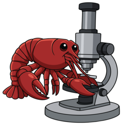

# Microclaw

<!-- The icon floats beside the description, never beside the <h1>: GitHub gives
     h1/h2 a full-width bottom border, and that rule would cut across the image. -->


An AI agent for [Micro-Manager](https://micro-manager.org) microscopy control. Describe your acquisition protocol in plain language; Microclaw translates it into Micro-Manager tool calls while the GUI responds in real time.

<br clear="left">


> [!CAUTION]
> The hardware safety features are not comprehensive. Always be mindful of what your microscope is doing. Use at your own risk.

## Architecture

```
User (natural language) → AgentLoop (Anthropic API) → ToolRegistry → SafetyGuard → MicroscopeController → pycro-manager ZMQ → MM GUI
```

- **Agent**: `claude-opus-4-8` via Anthropic API with tool use and prompt caching.
- **Safety**: User-defined `safety_config.yaml` enforced as a hard gate before every hardware call. The AI cannot override these limits.
- **Backend**: pycro-manager (ZMQ on port 4827). Open Micro-Manager normally; Microclaw connects to the running instance.

## Install (Windows)

You do not need Python, or a terminal. The installer brings its own.

**1. Install Micro-Manager and turn on its server.**
Install [Micro-Manager 2.0](https://micro-manager.org/Download_Micro-Manager_Latest_Release)
(a build later than 2026.06.26, for full functionality),
open it, and tick **Tools → Options → Run pycro-manager server on port 4827**.
Nothing can drive your microscope until you do this, and no installer can do it
for you.

**2. Download Microclaw.**
On this repository's page, click **Code → Download ZIP**, then right-click the
downloaded file and choose **Extract All**.

**3. Double-click `install.bat`** inside the extracted folder.

It installs everything into `%LOCALAPPDATA%\microclaw` — no administrator rights,
nothing else on your machine is touched — and puts a **Microclaw** icon on your
desktop. It takes a few minutes.

> Windows may show a blue **"Windows protected your PC"** banner, because the file
> came from the internet. Click **More info → Run anyway**.

**4. Edit your safety limits.**
The installer opens a `safety_config.yaml` for you. Its limits are **examples that
match no real microscope**, and they are the last thing standing between the AI and
your hardware. Set each one for your instrument, then change `reviewed: false` to
`reviewed: true` at the top of the file. Microclaw refuses to start until you do.

**5. Double-click the Microclaw icon.**
A console window opens — that is the server; closing it stops Microclaw — and a
browser window follows. It will ask for an Anthropic API key the first time.

To upgrade, download the ZIP again and double-click `install.bat` again. It is
safe to re-run: it upgrades in place, and leaves your safety limits and API key
alone. **Close Microclaw first** — while its console window is open, Windows
holds the installed files locked and the upgrade will fail.

### Running it later

The desktop icon is the whole interface. If you'd rather use a terminal, the
commands are `microclaw serve` for the browser GUI and `microclaw` for the REPL —
see [CLI options](#cli-options).

## Install from source (developers)

[`uv`](https://docs.astral.sh/uv/) is the supported toolchain; it downloads a
CPython for you, so nothing needs to be installed first.

```bash
uv venv --python 3.12
uv pip install -e ".[serve,test]"
uv run pytest
```

An existing conda environment works fine too — `pip install -e ".[serve,test]"`
inside it does the same thing. Then:

```bash
microclaw init     # writes this machine's safety limits, and opens them for editing
microclaw          # starts a session once you've reviewed them
```

`microclaw init` creates a per-user `safety_config.yaml` (in `~/.config/microclaw/`,
or `%APPDATA%\microclaw\` on Windows) and opens it. Its limits are the example's —
fictional, matching no real hardware — so Microclaw **refuses to start** until you
have edited them for your instrument and changed `reviewed: false` to
`reviewed: true` at the top. Pass `--safety-config PATH` to use a file somewhere
else; the same rule applies to it.

You will also need an `ANTHROPIC_API_KEY`: set it in the environment, or let the
browser GUI collect and store it (see [Browser GUI](#browser-gui)).

### Where things live

| What | Where |
|---|---|
| Safety limits | `%APPDATA%\microclaw\safety_config.yaml` |
| API key | your OS credential store, else `%APPDATA%\microclaw\config.toml` |
| The installed program | `%LOCALAPPDATA%\microclaw\env` |
| Desktop shortcut + its icon | your desktop, and `%LOCALAPPDATA%\microclaw` |
| Saved conversations | `*_microclaw_history.json`, in the folder Microclaw ran from |

On macOS and Linux, substitute `~/.config/microclaw` and `~/.local/share/microclaw`.

### CLI options

| Flag | Default | Purpose |
|---|---|---|
| `--safety-config PATH` | the file `microclaw init` wrote | Hardware-limits file enforced before every tool call. Must carry `reviewed: true`, whether it's the default or an explicit path. |
| `--port N` | `4827` | ZMQ port to reach the running Micro-Manager instance. Match the port set in **Tools → Options**. |
| `--model ID` | `$MICROCLAW_MODEL` or `claude-opus-4-8` | Anthropic model id. The `MICROCLAW_MODEL` environment variable overrides the built-in default; `--model` overrides both. |
| `--profile` / `--no-profile` | off | cProfile the session and print stats on exit. |
| `--save-history` / `--no-save-history` | on | Write the conversation to a timestamped `*_microclaw_history.json` file. |

### Viewing a saved history

Saved `*_microclaw_history.json` files are raw Anthropic messages — readable but
noisy. Render one as a browser transcript (user prompts, the agent's replies, and
every microscope tool call with its result, collapsed by default):

```
microclaw view-history 20260707_143437_microclaw_history.json
```

This writes a self-contained HTML file to your temp directory and opens it. Pass
`--no-browser` to just print the path. The viewer runs entirely locally — nothing
is uploaded. Snap thumbnails are rendered inline; tool calls are collapsed by
default.

### Browser GUI

Drive a session from a chat window instead of the terminal REPL. Same transcript,
plus a composer:

```bash
pip install -e ".[serve]"
microclaw serve                                  # → http://127.0.0.1:8000
```

Uses the safety config `microclaw init` wrote. The session flags
(`--safety-config`, `--port`, `--model`, `--save-history`) belong to the top-level
parser, so if you pass them they go *before* `serve`:
`microclaw --safety-config other.yaml serve`.

| Flag | Default | Purpose |
|---|---|---|
| `--host ADDR` | `127.0.0.1` | Bind address. Anything but loopback needs `--allow-remote`. |
| `--web-port N` | `8000` | HTTP port for the GUI. |
| `--no-browser` | off | Print the URL instead of opening a browser window. |
| `--allow-remote` | off | Permit an authenticated non-loopback bind. Requires `--behind-tls-proxy`. |
| `--behind-tls-proxy` | off | Assert a trusted TLS-terminating proxy is in front. Requests are served only with `X-Forwarded-Proto: https`; use only when that proxy overwrites the header. |

A browser window opens once the server is accepting connections.

Remote mode refuses direct cleartext HTTP. Put the server behind a trusted
TLS-terminating proxy, pass both `--allow-remote --behind-tls-proxy`, and ensure
the proxy overwrites (rather than merely forwards) `X-Forwarded-Proto` with
`https`. At startup Microclaw prints a long-lived bearer token for non-browser
API clients and a single-use browser pairing URL. The pairing code is in the URL
fragment, is cleared from the address bar before exchange, expires after 15
minutes, and becomes a 12-hour HttpOnly, Secure, SameSite=Strict cookie. A code
can also be pasted into the page manually. Set `MICROCLAW_REMOTE_TOKEN` to use a
stable operator-managed token (minimum 32 characters); otherwise a token is
generated for that process and is never persisted. An authenticated bearer may
POST `/api/pair/code` to mint a replacement pairing code.

JSON request bodies are capped at 64 KiB globally, except `/api/prompt`, which
allows 256 KiB. Oversized requests receive HTTP 413.

### Desktop shortcut (Windows)

```
microclaw install-shortcut
```

Puts a **Microclaw** icon on the desktop that launches the browser GUI — no
terminal, no flags. The console window it opens *is* the server: it shows the
connection status and any startup error, and closing it stops Microclaw.

The shortcut runs `serve` and nothing else. It is always loopback-only, and it
loads the safety limits from the config `microclaw init` wrote — which must say
`reviewed: true`, or it refuses to start and tells you so.

| Flag | Purpose |
|---|---|
| `--dry-run` | Print what would be written, and where, without writing it. |
| `--remove` | Delete a previously installed shortcut. |
| `--dest DIR` | Write to a directory other than the desktop. |

Run it again after moving or reinstalling the environment; the shortcut points at
the `microclaw` it was created from.

The server holds one microscope and one conversation. A turn takes the session
lock, so a second prompt is refused (HTTP 409) rather than interleaving tool calls
on the hardware; requests carrying a foreign `Origin` are refused outright, so a
stray browser tab cannot drive the stage. History is written after every turn, and
illumination is shuttered on shutdown, exactly as in the REPL.

If `ANTHROPIC_API_KEY` is unset, the page collects a key and (optionally) stores it
in your OS credential store via `keyring`, falling back to
`~/.config/microclaw/config.toml` (`%APPDATA%\microclaw\` on Windows). The key is
never echoed back — only a four-character suffix, to confirm which one is set — and
it is never written to `safety_config.yaml`. Resolution order is environment
variable, then keyring, then that file. Under `--allow-remote` the key cannot be
set from the browser at all.

To swap keys mid-session, click the `key …AA8f` chip in the header. Saving without
*Remember on this machine* applies the key to the running process only, so a key
already in the credential store comes back on the next start — the UI says so when
that is the case.

## Safety configuration

Run `microclaw init` to write this rig's `safety_config.yaml`, then edit it to set the real hardware limits. These are enforced before every tool call and cannot be overridden by the AI.

Safety files use `schema_version: 2`. Stage and named-stage ranges declare the
actuators the profile covers. Every declared axis needs two finite bounds in
guaranteed mode; an explicit `{unbounded: true, reason: "..."}` is retained for
audit or degraded operation but does not provide guaranteed containment.

The file starts with a gate. Nothing runs until a human has read the limits and flipped it:

```yaml
# Microclaw REFUSES TO START until you have gone through this file, set each
# limit for THIS instrument, and changed the line below to `reviewed: true`.
schema_version: 2
reviewed: false
rig_profile:
  mode: guaranteed
  categorical_properties: []
  excluded_properties: []
```

`categorical_properties` is the reviewed list of discrete (non-continuous)
device properties the AI may write directly. Filter wheels, sliders and turrets
do not belong on it: any device Micro-Manager types as a **StateDevice** has its
own `Label`/`State` auto-classified as categorical at startup, and nothing else
on that device. Shutters are never auto-classified — `Core.Shutter`, an MM
`ShutterDevice`, and anything declared under `illumination` stay on the
illumination gate, which is where a confirmation is required before light
reaches the sample. `microclaw --safety-config … authorization-map` prints the
effective map; auto-classified entries carry `"source": "auto:state-device"`,
declared ones `"source": "declared"`.

Auto-classification fills vacuums only. Naming a device's `Label` **or** `State`
in `categorical_properties` or `excluded_properties` means you own both: declare
the one you will actually write, and the other stays refused. So if you are not
sure whether a driver takes `Label` (string) or `State` (int), declaring one does
not quietly hand you the other.

The following fragments show the limits and a separate worked channel profile
(the shipped values are examples, not defaults):

```yaml
stage:
  x_min: -5000.0
  x_max:  5000.0
  y_min: -5000.0
  y_max:  5000.0
  z_min:  0.0
  z_max:  200.0

camera:
  max_exposure_ms: 5000.0

# Required section; all nine finite positive values are required. Counts are
# frames, times are seconds/ms as named, and bytes are raw
# camera payload estimates. Hard maxima refuse work; confirm_above_* values
# invoke the existing blocking acquisition confirmation below those maxima.
acquisition:
  max_frames: 10000
  max_duration_s: 3600
  max_bytes: 50000000000
  max_illuminated_ms: 600000
  max_session_illuminated_ms: 1800000
  confirm_above_frames: 500
  confirm_above_duration_s: 300
  confirm_above_bytes: 5000000000
  confirm_above_illuminated_ms: 60000

List-backed pycro-manager acquisitions pass their event lists directly to the
engine. They cannot be cancelled mid-run; this is not new, because they never
could be. Generator feeding was measured at 3.14x the list cost and removed;
the evidence and decision are recorded in design/32 §2. Adaptive surveys
still require generators because later events do not exist until a hook
produces them. `max_duration_s` bounds a known-low preflight estimate: exposure
and scheduled start times are included, but unmeasured readout, stage,
autofocus, and filter switching overhead is not. MMStudio MDA is planned and
confirmed from its current settings, and its opaque `run_acquisition()` call
runs to completion.

Adaptive survey reservations cover exactly the planned grid size. A hook may
choose or revisit events within that allowance, but it cannot add an extra
derived revisit beyond the planned frame count; budget exhaustion is logged and
reported as an early stop.

# In guaranteed mode, a channel preset is authorized by both its name and every
# device/property effect Micro-Manager expands it to. Filter wheels, sliders and
# turrets need no declaration — see the note below — so if DAPI only moves those,
# the name is enough. Declare any other discrete effect, e.g. a laser selector:
# Replace the empty rig_profile fragment above with:
rig_profile:
  mode: guaranteed
  categorical_properties:
    - {device: LaserSelector, property: Label}
  excluded_properties: []
channels:
  allowed: [DAPI]

# A missing preset, an unlisted effect, or a preset effect requiring a deferred
# typed executor is refused at startup. Leave `channels` absent until the names
# and all effects have been reviewed on this rig.

# Optional filesystem sandbox for file-touching tools (hook reads/writes,
# position-list saves, TIFF export). Unset = unrestricted. When set, those tools
# are confined to this directory; `..` and symlink escapes are rejected.
# workspace_dir: /data/microclaw

# Micro-Manager plugin hooks run arbitrary Java that bypasses the checks above,
# so they have their own two gates.
plugins:
  # Fully-qualified classpaths to forbid. Analyzer (read-only) plugins are
  # allowed by default; list only the ones to block. Normally empty.
  blocked: []
  # Hardware-motion plugins (e.g. autofocus) are gated behind this single flag,
  # not a per-plugin list. Default off; a human flips it to opt in.
  allow_hardware_motion: false
```

## Testing

Unit and agent tests run without Micro-Manager:

```bash
pytest
```

Integration tests require a running MM instance with the Demo configuration:

1. Open Micro-Manager and load `MMConfig_demo.cfg`.
2. Set `MM_RUNNING=1` (and optionally `MM_PORT` if not using the default 4827).
3. Run:

```bash
MM_RUNNING=1 pytest -m integration
```

## Available tools

| Tool | Description |
|---|---|
| `snap_and_analyze` | Snap, display in the MM viewer, and return focus metric, intensity stats, and optional thumbnail (display only; use `run_timelapse` with `n_frames=1` to save) |
| `start_live_view` / `stop_live_view` | Live camera preview |
| `set_exposure` / `get_exposure` | Camera exposure |
| `get_roi` / `set_roi` / `clear_roi` | Camera region of interest |
| `get_pixel_size` | Effective pixel size at the sample plane (µm) |
| `move_stage_xy` / `get_xy_position` | XY stage |
| `move_stage_z` / `get_z_position` | Z (focus) stage |
| `list_stages` / `get_stage_position` / `move_named_stage` | Any single-axis stage addressed by label (guarded by per-device `named_stages` limits) |
| `calibrate_stage_to_camera` | Measure the stage↔camera affine (pixel size, rotation, axis flips) in ~4 snaps |
| `find_features` / `center_feature` | Spot count, centroid, offset from centre; closed-loop centring |
| `set_channel` / `get_available_channels` | Channel presets |
| `set_device_property` / `get_device_property` | Raw device properties |
| `list_devices` | List loaded devices |
| `list_device_properties` | List all property names for a device |
| `get_device_property_info` | Type, limits, and allowed values for a property |
| `get_full_device_state` | All property values for a device |
| `get_system_state` | Composite state snapshot |
| `run_autofocus` | Software autofocus Z-sweep (reports both passes; refuses to move on a flat metric curve) |
| `get_focus_lock_state` / `set_focus_lock` | Read/drive the hardware focus lock (via the EMU map) |
| `run_zstack` | Z-stack acquisition |
| `run_timelapse` | Timelapse acquisition |
| `export_dataset_as_tiff` | Export NDTiff dataset to ImageJ TIFF |
| `mark_position` | Mark current stage position (mirrored into MM's Position List Manager) |
| `get_position_list` | Return all marked positions |
| `go_to_position` | Move stage to a named position |
| `delete_position` | Delete a named position |
| `clear_position_list` | Clear all positions |
| `save_position_list` | Save MM's native position list to an interoperable `.pos` file |
| `load_position_list` | Transactionally load a native Micro-Manager position file |
| `import_mm_positions` | Import positions from the MM GUI position list |
| `run_multiposition_acquisition` | Visit each position and run snap/zstack/timelapse |
| `run_tile_acquisition` | Acquire a rows×cols tile grid centered on current stage position |
| `run_multiposition_with_autofocus` | Same, with software autofocus at each position. `protocol="timelapse"` requires explicit `protocol_params` (`n_frames` and `interval_s`) because unspecified work cannot be planned or reserved. |
| `run_adaptive_zstack` | Z-stack with a hook strategy for adaptive behaviour |
| `run_adaptive_timelapse` | Timelapse with a hook strategy for adaptive behaviour |
| `read_hook_log` | Read hook output log after an acquisition |
| `list_hooks` | List pre-coded and saved hook strategies |
| `get_hook_documentation` | Return the pycro-manager hook API reference (called automatically before hook generation) |
| `generate_and_save_hook` | Validate and save a hook script |
| `read_hook_from_file` | Read and AST-scan a user-provided hook file |
| `list_mm_plugins` | List installed MM plugins grouped by role (autofocus, processor, …) for use as hooks |
| `get_smlm_documentation` | Return the SMLM protocol reference (dSTORM/PALM/PAINT parameters, acquisition protocol, drift correction, post-processing, pitfalls) |
| `check_emu_installed` | Detect whether EMU and htSMLM are installed by scanning the Micro-Manager plugins directory for their JARs |
| `get_htsmlm_documentation` | Return the htSMLM/EMU reference (UIProperty inventory, control workflow, panel descriptions) — only called if EMU/htSMLM is detected or user mentions it |
| `get_emu_configuration` | Read the EMU config and return the structured map (lasers by slot, filter-wheel state table, focus lock) for the active htSMLM configuration — only called if EMU is detected or user mentions it |
| `get_emu_laser_map` / `resolve_emu_device` | Slot→laser table (each slot's own enable/power/trigger lines); resolve a semantic name to a device-property |
| `save_knowledge` | Save a non-standard fact about a sample, device, or strategy to the persistent knowledge base |
| `get_knowledge` | Retrieve entries from the persistent knowledge base |
| `delete_knowledge` | Remove a single entry from the persistent knowledge base |
